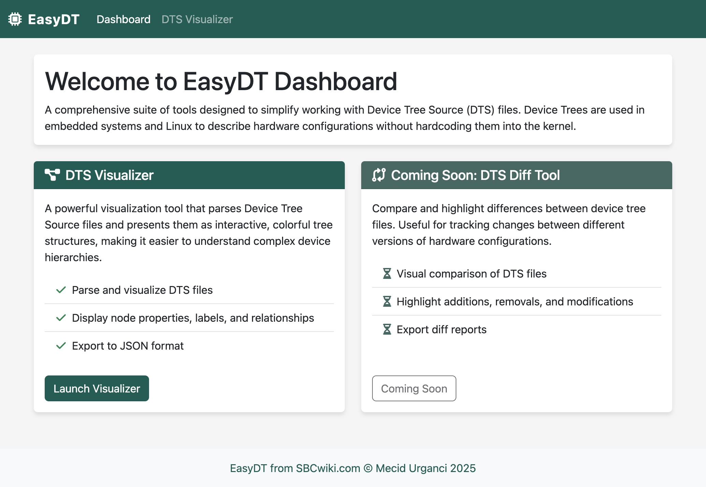

# EasyDT - Device Tree Tools Collection



A comprehensive collection of tools designed to simplify working with Device Tree Source (DTS) files. Device Trees are used in embedded systems and Linux to describe hardware configurations without hardcoding them into the kernel.

## Tools Included

### DTS Visualizer

A powerful visualization tool that parses Device Tree Source files and presents them as interactive, colorful tree structures, making it easier to understand complex device hierarchies.

[View DTS Visualizer Documentation](./dts_visualizer/README.md)

**Key Features:**
- Parses and visualizes DTS files as intuitive tree structures
- Displays node properties, labels, and relationships
- Supports exporting to JSON format
  - Export complete device tree structure including nodes, properties, and labels
  - JSON output can be used for programmatic analysis or integration with other tools
  - Custom output path can be specified
- Command-line interface for easy integration into workflows

### Web Dashboard

A web-based dashboard that provides a user-friendly interface to the EasyDT tools. Access and use the tools through a modern web interface without needing to use the command line.

[View Web Dashboard Documentation](./web_dashboard/README.md)

**Key Features:**
- Modern, responsive web interface
- Upload and visualize DTS files in the browser
- Interactive tree view for exploring device tree structures
- Export visualized data as JSON
- Easy-to-use drag-and-drop interface

## Why Use EasyDT?

Device Trees can be complex and difficult to navigate, especially for large hardware configurations. EasyDT provides tools that make working with device trees more accessible by:

- Visualizing complex hierarchical relationships
- Providing intuitive interfaces to understand hardware descriptions
- Simplifying the process of analyzing and debugging device tree issues

## Requirements

Each tool has its own specific requirements, but generally:
- Python 3.12+
- Various Python libraries as specified in each tool's requirements.txt

## Getting Started

1. Clone this repository:
   ```
   git clone https://github.com/HeyMeco/easydt.git
   cd easydt
   ```

2. Navigate to the specific tool you want to use:
   ```
   cd dts_visualizer
   ```

3. Install the required dependencies and follow the tool-specific instructions.

### Using the Web Dashboard

1. Navigate to the web dashboard directory:
   ```
   cd web_dashboard
   ```

2. Run the dashboard:
   ```
   ./run.sh
   ```

3. Open your web browser and go to http://localhost:5000

4. Use the dashboard to access the EasyDT tools through a web interface.

## Future Tools (Planned)

- **DTS Diff Tool**: Compare and highlight differences between device tree files

## Contributing

Contributions are welcome! If you have ideas for new tools or improvements to existing ones, please feel free to:
- Open an issue
- Submit a pull request
- Share your feedback

## License

This project is licensed under the GNU General Public License v3.0 - see the LICENSE file for details. 